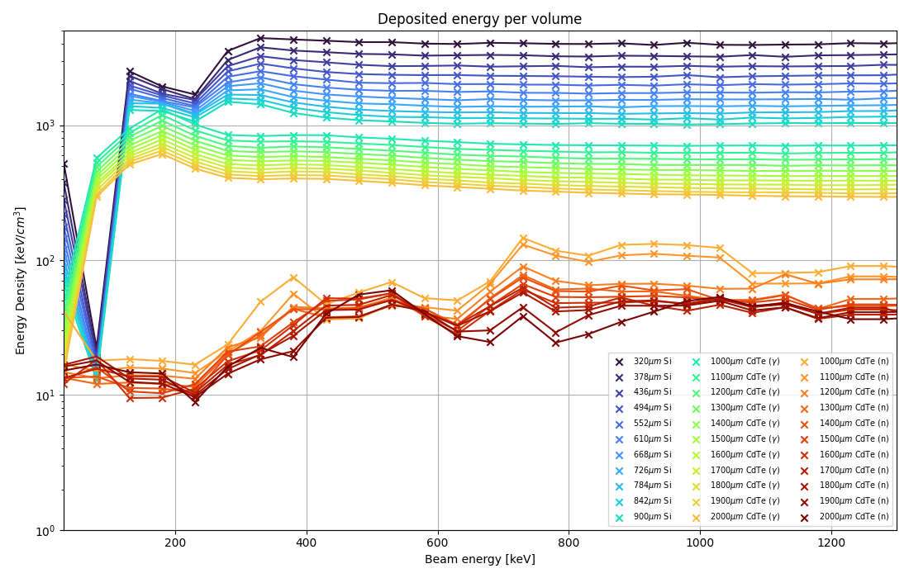

# HEP-simulations
High Energy Physics simulations using FLUKA and Geant4

## Running FLUKA simulations
1. Install dependencies manually or by running

       pip install -r requirements.txt
1. Create _.inp_-files
    * Format: __\<bulk identifier/material>__-__\<index for bulk thickness>__-__\<index for beam energy>__.inp
    * Easiest is to use Loop-tool in Flair to create runs iterating over a parameter and then run them with 0 repetitions. This throws an error, but the _.inp_ file is created.
1. Run _generate_runs.py_
    * This runs the simulation and combines the results with _usXsuw_-programs (part of FLUKA installation).
    * After combining results, also removes removes the large binaries (denoted by *_fort*), possibly totaling up to hundreds of gigabytes of data
1. Run _plot_attenuation.py_
    * Calls method from output_processing.py to convert boundary crossing fluences to tabular form (.csv) and then plots them.
1. Run _plot_energy_and_displacements.py_
   * Similarly to the previous one, converts files to csv and plots figures of displacements and deposited energy.
   * Also plots separate heatmaps for every simulation if not disabled. Disabling does not effect the summary plots created from csv-file.
1. Run _plot_fluence.py_
   * Plots boundary crossing fluences and fluences inside bulk material to separate files.

## Results of FLUKA simulation
### Relative intensities
* How much the bulk resists the beam as a function of energy

.png)
.png)

### Logarithm of reciprocal values of the previous plot + linear fits
* Beer-Lambert: attenuation coefficient µ = ln(\<**entering fluence>**/**\<exiting fluence>**)/**\<thickness of bulk>** = slopes of plots below

.png)
.png)

### Attenuation coefficients
* Beer-Lambert law
* Reference values from Nist XCOM database (only available for photons)

.png)
.png)

## Deposited energy per volume
* Calculated as sums of USRBIN card results, divided by volume

## Deposited energy per volume
* Calculated as sums of USRBIN card results, divided by volume

## References
* http://ijrr.com/article-1-1895-en.html
* NIST XCOM Photon cross sections https://www.physics.nist.gov/PhysRefData/Xcom/html/xcom1.html
* NIST cross section to attenuation coefficient https://www.physics.nist.gov/PhysRefData/XrayMassCoef/chap2.html
